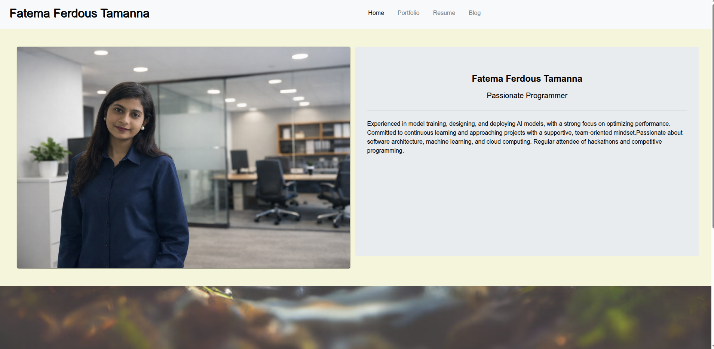
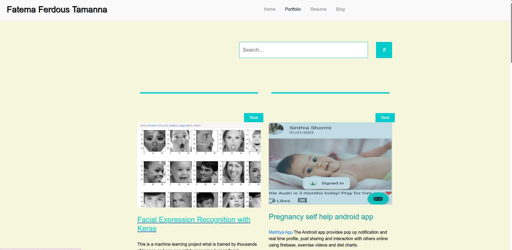
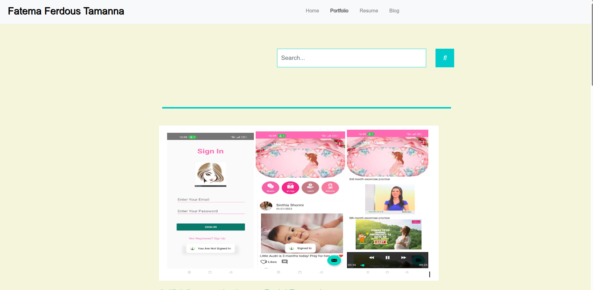
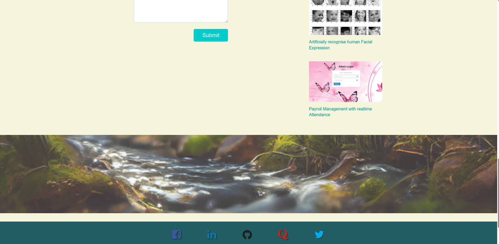

# 🌐 Fatema Ferdous Tamanna — Portfolio Website

Welcome to my personal portfolio website!
This site showcases my projects, technical skills, and work in software development, machine learning, and web applications.

---

## 🚀 Live Preview

Example: https://empresst.github.io/index.html

---

## 🧑‍💻 About Me

I am a Computer Science and Engineering graduate passionate about building real-world solutions through software development, machine learning, and web technologies. I enjoy turning ideas into functional and impactful applications.

---

## 🛠️ Tech Stack

### Frontend

* HTML5
* CSS3
* Bootstrap 4

### Libraries & Tools

* jQuery
* Font Awesome
* Google Fonts

### Template

* TemplateMo (Xtra Blog Template)

---

## 📂 Project Structure

```
├── index.html
├── portfolio.html
├── resume.html
├── blog1.html
├── css/
│   ├── bootstrap.min.css
│   ├── master.css
│   └── templatemo-xtra-blog.css
├── js/
│   ├── jquery.min.js
│   └── templatemo-script.js
├── images/
└── posts/
```

---

## ✨ Features

* Responsive design using Bootstrap
* Portfolio project showcase
* Blog-style project presentation
* Resume page
* Social media integration
* Clean and modern UI

---

## 📌 Highlighted Projects

### 🔹 Facial Expression Recognition

A machine learning project trained on image datasets to recognize human facial expressions.

### 🔹 Pregnancy Self-Help Android App

An Android application with real-time interaction, notifications, and health guidance using Firebase.

### 🔹 Payroll Management System

A web-based system that calculates payroll based on attendance, taxes, and deductions.

---

## ⚙️ Installation & Usage

1. Clone the repository:

```bash
git clone https://github.com/empresst/empresst.github.io.git
```

2. Navigate to the project folder:

```bash
cd empresst/empresst.github.io
```

3. Open `index.html` in your browser.

---

## 📈 Future Improvements

* Convert to React / Next.js
* Add backend integration (FastAPI / Node.js)
* Dynamic blog system
* Dark mode support
* Improved UI/UX design

---

## 🤝 Connect with Me

* LinkedIn: https://www.linkedin.com/in/fatematamanna/
* GitHub: https://github.com/empresst

---

## 📄 License

This project is open-source and available for personal and educational use.

---

## 💡 Note

This portfolio is built using a customized template and modified to reflect my personal projects and style.

---




---

⭐ If you like this project, feel free to star the repository!
